# ParaBank Test Automation

This project is a test automation framework created for the ParaBank demo application.

The main goal was to build a simple framework that combines API and UI testing while keeping the code easy to understand and maintain.

The framework uses Java, Maven, Cucumber, TestNG, Selenium WebDriver, Rest Assured and PicoContainer.


Application under test:

```text
https://parabank.parasoft.com/parabank/
```

## Swagger page

The ParaBank REST API documentation is available here:

```text
https://parabank.parasoft.com/parabank/api-docs/index.html
```

---

## Known limitation and login recovery

The UI tests depend on the public ParaBank demo environment.

During development, the normal customer login sometimes returned one of the following server-side messages:

```text
An internal error has occurred and has been logged.
```

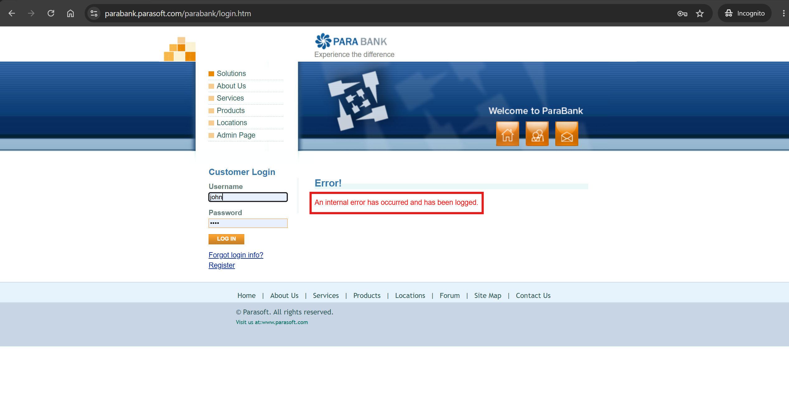

```text
The username and password could not be verified.
```

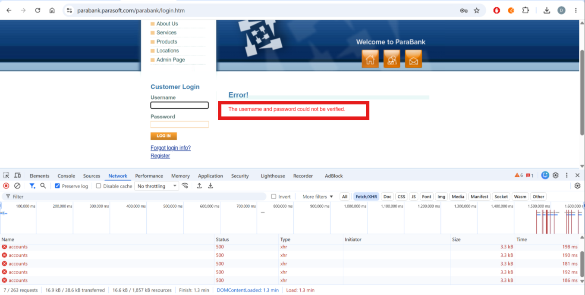

When this happens, the customer dashboard is not loaded and authenticated functions such as **Open New Account** and **Bill Pay** are unavailable.

To make the UI scenarios more resilient, the framework keeps the normal username/password login as the primary path.

In the hybrid UI scenarios, the API first validates the configured demo customer. If the normal UI login then displays an error, the framework uses ParaBank's official **Customer Lookup** page as a fallback.

The recovery flow is:

```text
API validates the demo customer
→ Normal UI login
→ Login succeeds: continue the scenario
→ Login error displayed: open "Forgot login info?"
→ Fill Customer Lookup with the demo customer information
→ ParaBank opens an authenticated customer session
→ Continue the original scenario
```

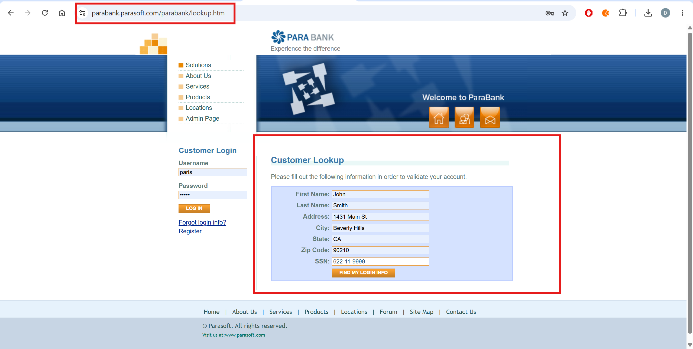

The fallback is only reached after the API has successfully validated the configured customer. If the API validation fails, the scenario stops before the UI recovery flow.

This recovery mechanism is useful because it:

- keeps the normal login flow as the default;
- handles an intermittent issue in the public environment;
- does not hard-code or reuse cookies such as `JSESSIONID`;
- uses an official ParaBank user journey;
- keeps recovery details inside Page Objects instead of feature files.

The Customer Lookup page displays the recovered password because ParaBank is a demonstration application.

---

## Project overview

The project currently contains 9 automated test scenarios.

### API scenarios

- Login with valid credentials
- Login with invalid credentials
- Create a new bank account with valid data
- Reject account creation with an invalid funding account

### UI scenarios

- Open a new savings account
- Pay a bill with valid data
- Reject a bill payment with missing mandatory information
- Reject a bill payment with an invalid amount such as `abc`

### Framework startup scenario

- Check that Cucumber starts correctly
- Check that the configuration file can be loaded

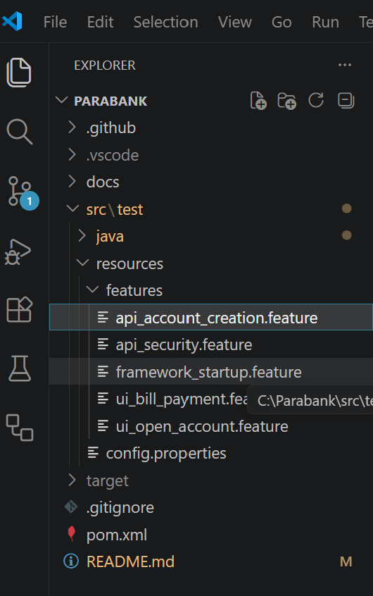

---

## Test approach

The UI tests use a hybrid approach.

The API prepares the required back-end state before Selenium starts the browser.

Example flow:

```text
API login
→ API gets the customer ID
→ API gets or creates a source account
→ API deposits money when required
→ Selenium authenticates the customer
→ Selenium performs the UI action
→ Cucumber verifies the result
```

This approach avoids preparing all test data through long and fragile UI forms. It also makes the scenarios faster and more stable.

---

## Technologies

- Java 17
- Maven
- Cucumber 7
- TestNG
- Selenium WebDriver
- Rest Assured
- PicoContainer
- GitHub Actions

---

# Setup

The following setup was used on Windows 11.

## 1. Install Java 17

Download and install a Java 17 JDK.

After installation, open PowerShell and run:

```powershell
java -version
```

Expected result:

```text
openjdk version "17..."
```

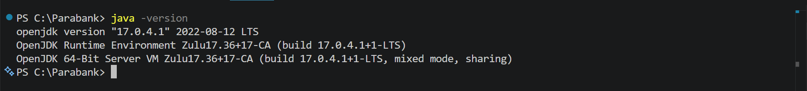

### Configure `JAVA_HOME`

Open:

```text
Windows Search
→ Edit the system environment variables
→ Environment Variables
```

Create a new system variable:

```text
Variable name: JAVA_HOME
Variable value: C:\Program Files\Java\<your-jdk-folder>
```

Example:

```text
C:\Program Files\Java\ZuluJDK17_x64
```

Then edit the Windows `Path` variable and add:

```text
%JAVA_HOME%\bin
```

Close and reopen PowerShell, then verify:

```powershell
echo $env:JAVA_HOME
java -version
```

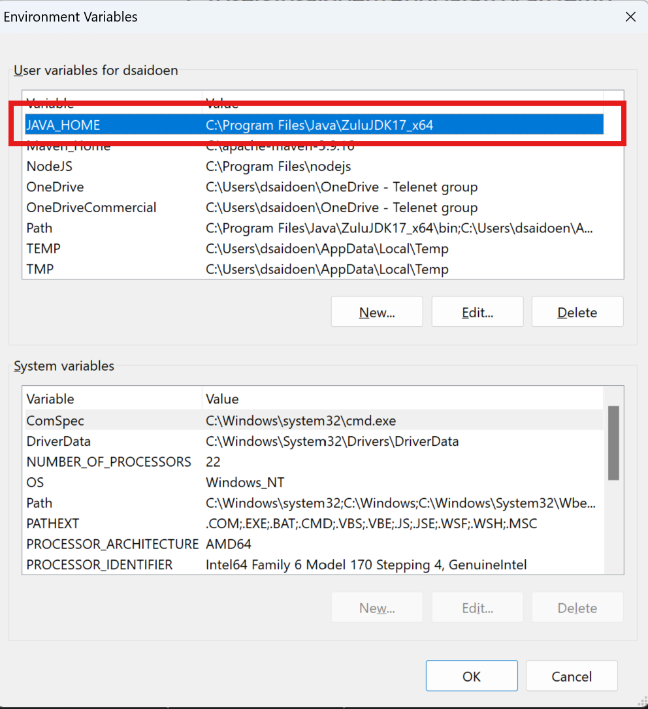
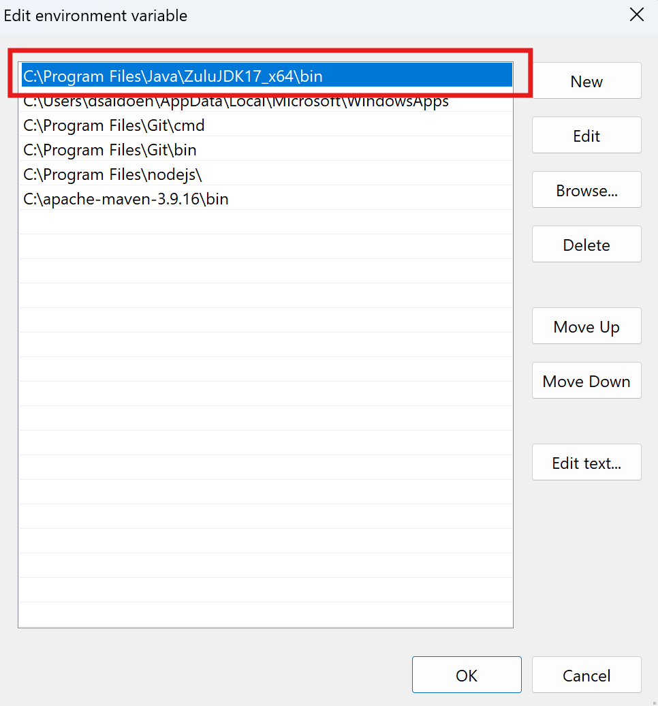

---

## 2. Install Maven

Download Apache Maven and extract it to a local folder.

Example:

```text
C:\apache-maven-3.9.16
```

Create a system or user variable:

```text
Variable name: MAVEN_HOME
Variable value: C:\apache-maven-3.9.16
```

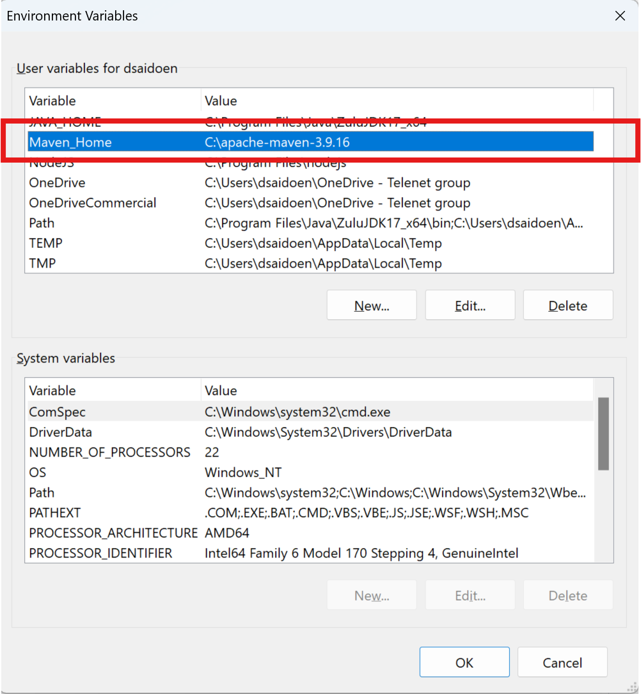

Add this value to the Windows `Path`:

```text
%MAVEN_HOME%\bin
```

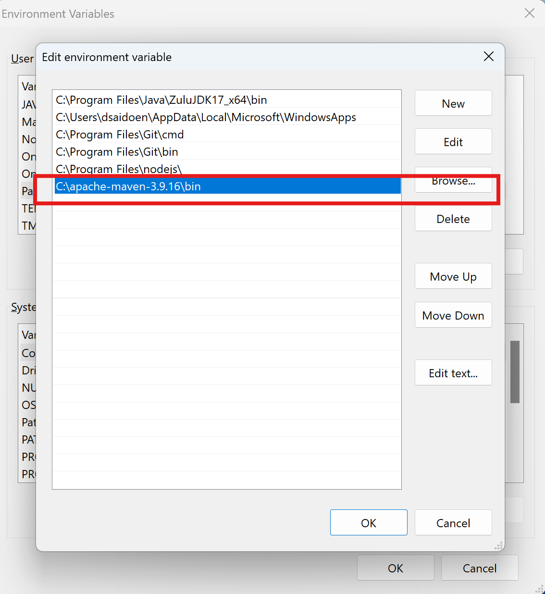

Restart PowerShell and verify the installation:

```powershell
mvn -version
```

The output should display both Maven and Java 17.

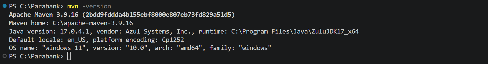

---

## 3. Install Git

Install Git for Windows.

Verify the installation:

```powershell
git --version
```

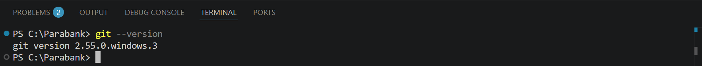

---

## 4. Install Google Chrome

The UI tests use Google Chrome.

Make sure Chrome is installed and updated.

Selenium Manager automatically finds and manages the required ChromeDriver, so no manual ChromeDriver setup is required.

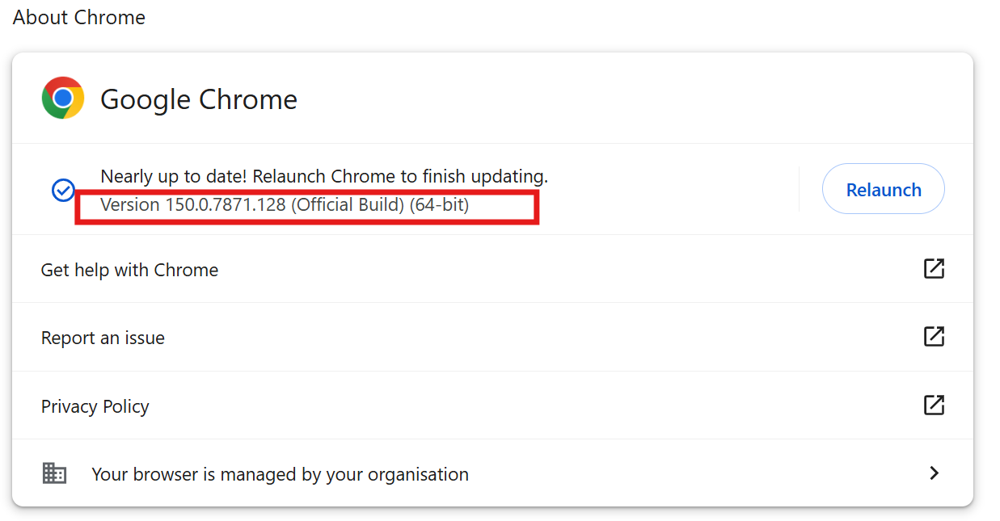

---

## 5. Clone the repository

Open PowerShell and run:

```powershell
git clone https://github.com/SaidounDjahid/Parabank.git
cd Parabank
```

Check the repository:

```powershell
git status
```

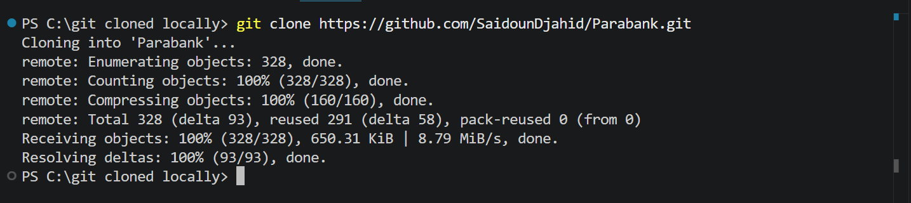
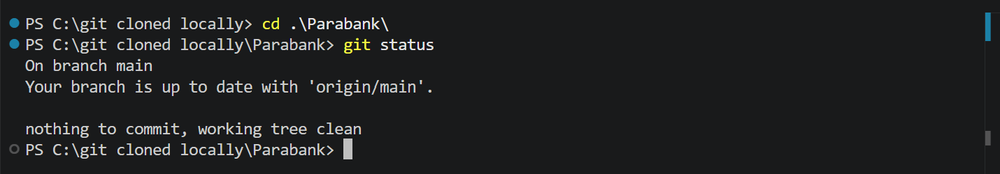

---

## 6. Open the project

The project can be opened with Visual Studio Code or IntelliJ IDEA.

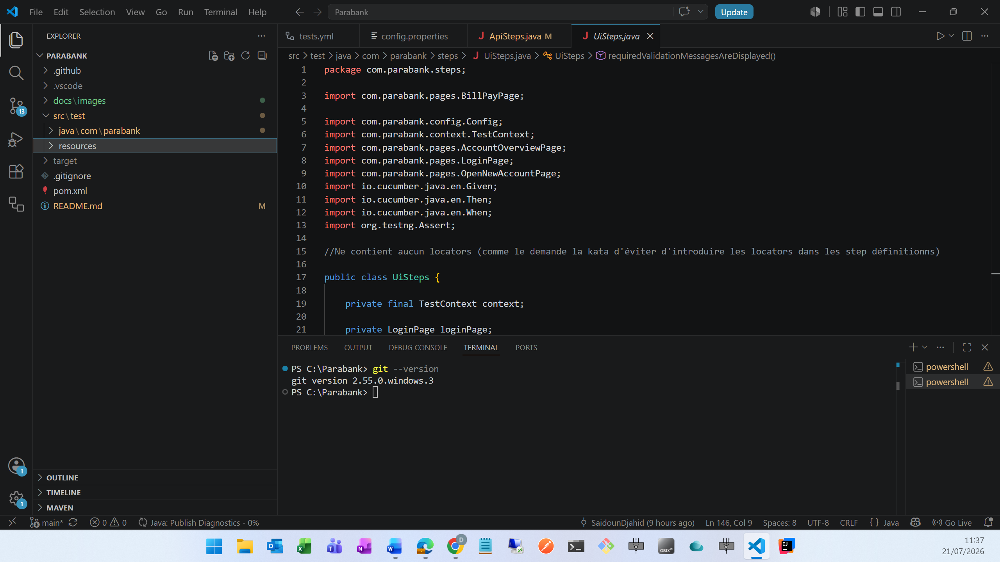

Optional VS Code extensions:

- Extension Pack for Java
- Cucumber
- GitHub Actions

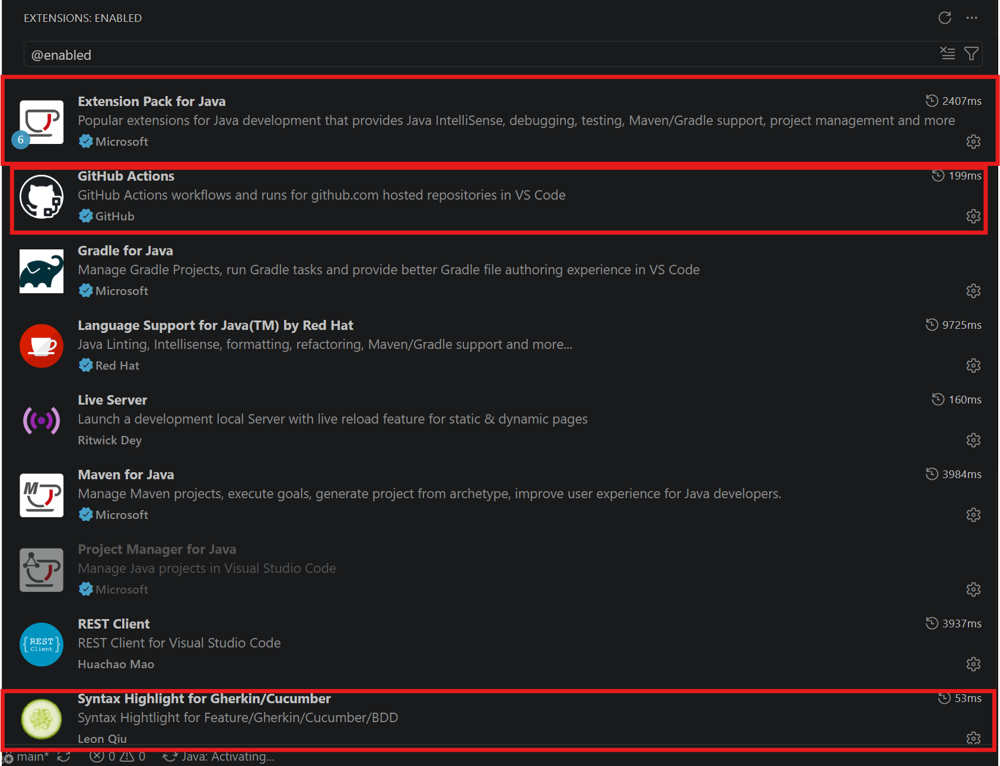

---

## 7. Check the configuration

The main configuration file is:

```text
src/test/resources/config.properties
```

Example:

```properties
ui.base.url=https://parabank.parasoft.com/parabank/
api.base.url=https://parabank.parasoft.com/parabank/services/bank

username=john
password=demo

customer.first.name=John
customer.last.name=Smith
customer.street=1431 Main St
customer.city=Beverly Hills
customer.state=CA
customer.zip.code=90210
customer.ssn=622-11-9999

wait.seconds=30
headless=false

billpay.deposit=500.00
```

The customer fields are used by the Customer Lookup recovery flow after the API has validated the demo customer and the normal UI login displays an error.

The same file also contains the test payee information used by the Bill Pay scenarios.

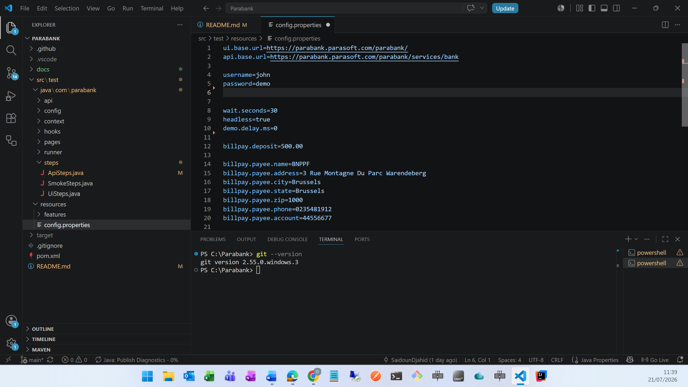

### Main properties

| Property | Purpose |
|---|---|
| `ui.base.url` | ParaBank website URL |
| `api.base.url` | ParaBank REST API URL |
| `username` | Demo customer username |
| `password` | Demo customer password |
| `customer.*` | Demo customer identity used by Customer Lookup |
| `wait.seconds` | Maximum Selenium wait time |
| `headless` | Runs Chrome without showing the browser |
| `billpay.deposit` | Amount deposited before the Bill Pay scenario |

System properties passed in the Maven command have priority over this file.

Example:

```powershell
mvn clean test '-Dheadless=true'
```

---

# Running the tests

## Compile the project

```powershell
mvn clean test-compile
```

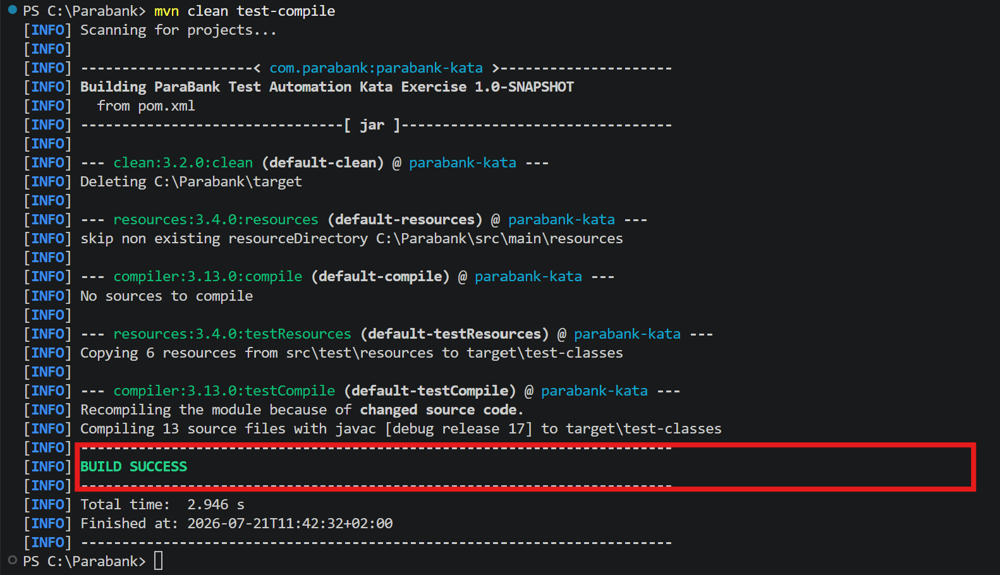

## Run all tests

```powershell
mvn clean test
```

Expected result:

```text
9 Scenarios (9 passed)
41 Steps (41 passed)
BUILD SUCCESS
```

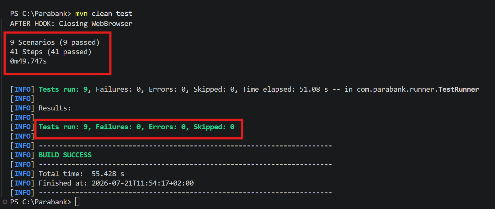

---

## Run only API tests

```powershell
mvn clean test '-Dcucumber.filter.tags=@api'
```

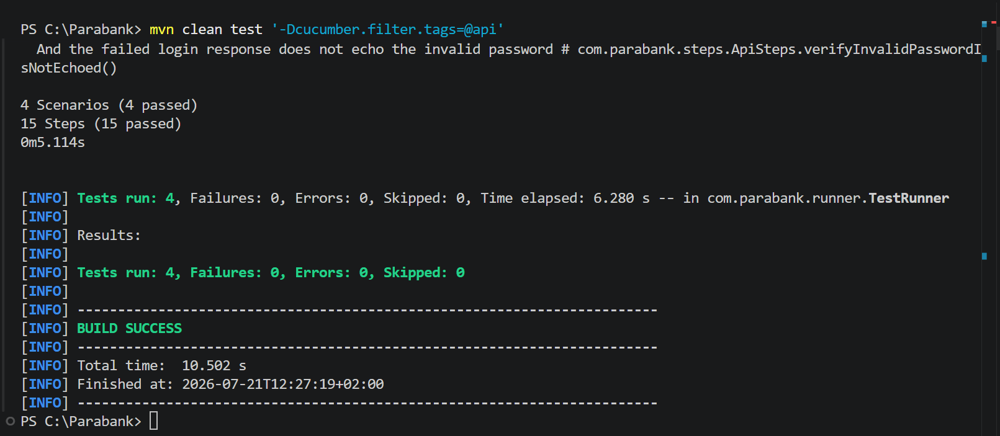

---

## Run only UI tests

```powershell
mvn clean test '-Dcucumber.filter.tags=@ui'
```

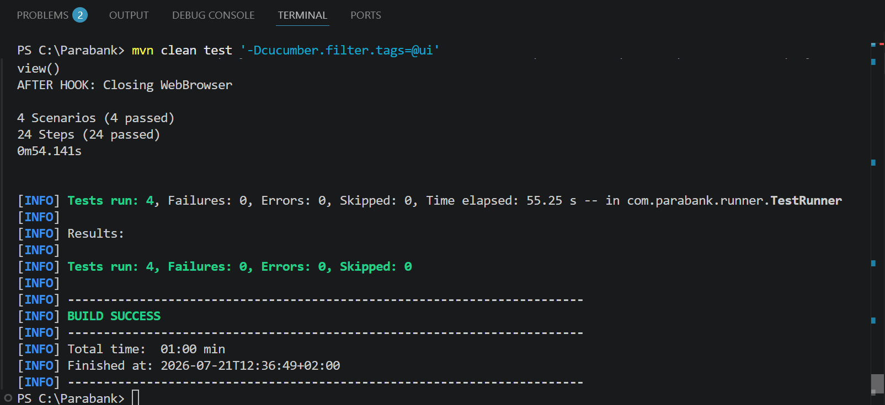

---

## Run with a visible browser

```powershell
mvn clean test '-Dheadless=false'
```

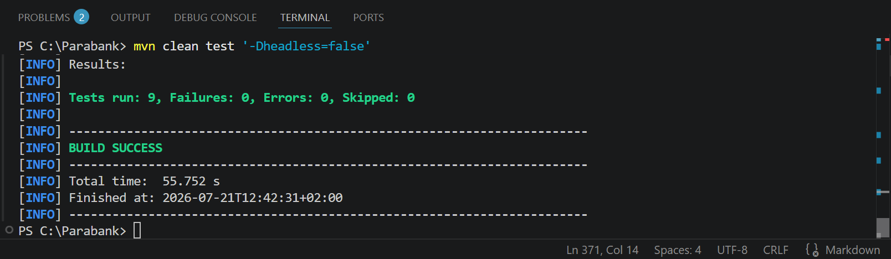

Chrome is controlled by Selenium:

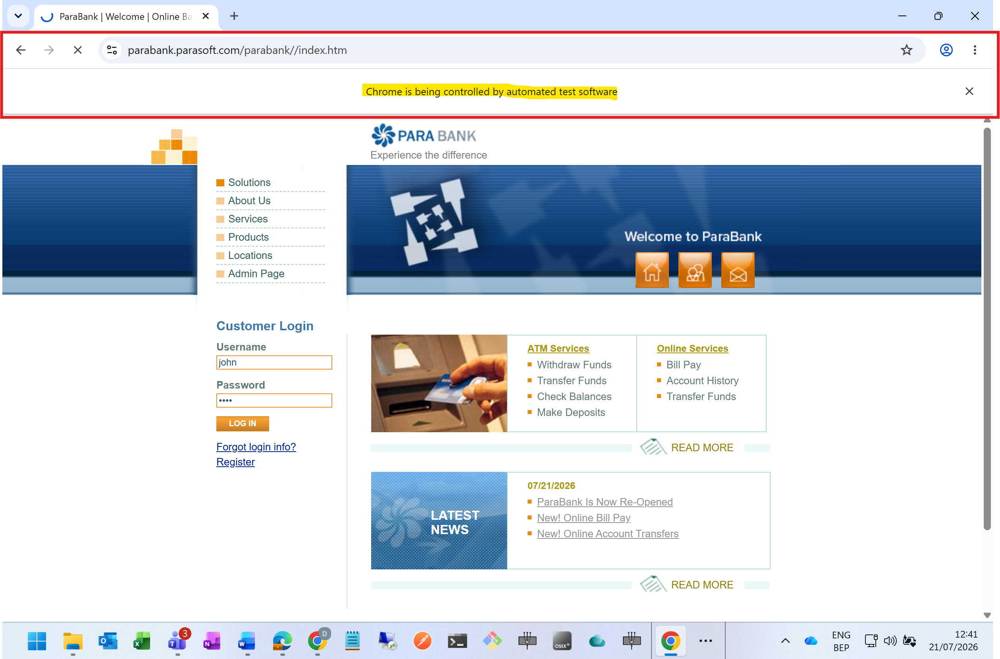

For CI execution, headless mode is used because the execution machine does not require a graphical interface.

---

# Reporting, Observability, and CI/CD

## Test Reports

Cucumber generates an HTML execution report after each test run.

Run the complete test suite:

```powershell
mvn clean test
```

The report is generated at:

```text
target/cucumber-report.html
```

On Windows, the tests can be executed and the report opened directly with:

```powershell
mvn clean test; Start-Process .\target\cucumber-report.html
```

The report contains:

- executed features and scenarios;
- passed and failed steps;
- execution duration;
- failure messages and stack traces.

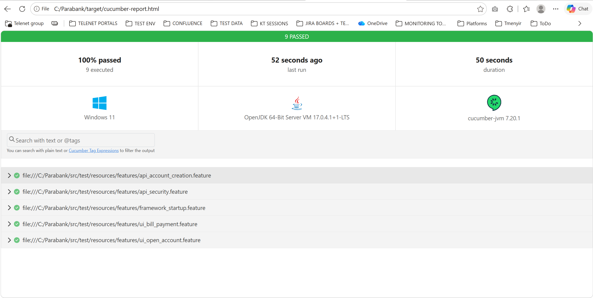

## Observability

Test execution can be monitored through:

- Maven output in the terminal;
- Cucumber scenario and step results;
- exception messages and stack traces;
- GitHub Actions execution logs;
- the generated Cucumber HTML report.

When the normal ParaBank UI login displays an error and the Customer Lookup recovery is used, the fallback decision and the original login error are also written to the execution logs.

## Continuous Integration

The GitHub Actions workflow is stored in:

```text
.github/workflows/tests.yml
```

It runs automatically after each push or pull request.

The workflow:

1. checks out the repository;
2. configures Java 17;
3. runs the Maven test suite on an Ubuntu runner;
4. executes the UI scenarios in headless mode;
5. marks the workflow as successful or failed according to the Maven test result.

A successful execution is displayed with a green status:

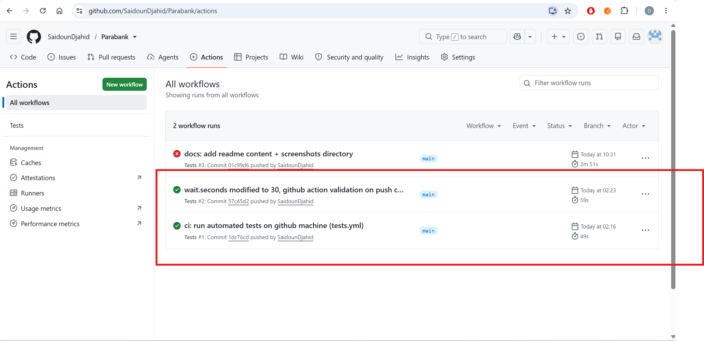

When one or more tests fail, the workflow is marked as failed and the execution logs provide the related scenario, exception and stack trace:

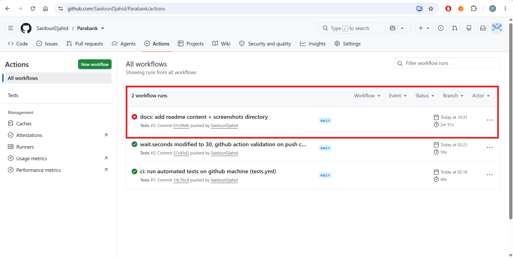

When GitHub Actions email notifications are enabled, the user who triggered the workflow may also receive an email containing the workflow status and a link to the execution details.

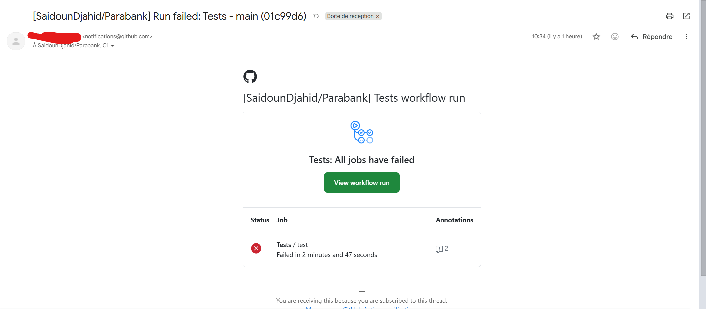

This validates that the framework can run on a clean Ubuntu environment and not only on the local Windows development machine.

---

# Main classes

## `ApiClient`

Contains the HTTP requests sent to the ParaBank REST API.

Examples:

- login
- get customer accounts
- create an account
- deposit money

## `ApiSteps`

Connects the API Gherkin steps to `ApiClient`.

It also saves dynamic API results inside `TestContext`.

## `TestContext`

Stores data shared during one scenario.

Examples:

- API response
- customer ID
- source account ID
- new account ID
- WebDriver

PicoContainer provides the same context object to the step and hook classes during a scenario.

## `Hooks`

Starts Chrome before scenarios tagged with `@ui` and closes it after the scenario.

## `BasePage`

Contains reusable Selenium actions such as:

- click
- type
- read text
- select an option
- wait for an element
- check whether an element exists
- wait for one of several possible page outcomes

These helper methods are reused by all Page Objects.

## Page Objects

Each Page Object represents one part of the ParaBank website.

- `LoginPage` handles the normal username/password login and detects login outcomes
- `CustomerLookupPage` handles the official recovery form used when the validated demo customer cannot log in through the normal UI flow
- `OpenNewAccountPage` handles account creation
- `AccountOverviewPage` verifies that an account is displayed
- `BillPayPage` handles bill payment and validation messages

### Why `CustomerLookupPage` is separate

Customer Lookup is a different page with its own URL, fields, button and result.

Keeping it in a separate Page Object:

- follows the Page Object Model;
- avoids mixing two different screens inside `LoginPage`;
- keeps locators close to the page that owns them;
- makes the recovery flow easier to maintain and explain.

## `UiSteps`

Connects the UI Gherkin steps to the Page Objects.

It coordinates the normal login and the conditional Customer Lookup recovery, but it does not contain page locators.

The existing Gherkin step remains:

```gherkin
And the customer is logged in to the web portal
```

No extra feature step is required because Customer Lookup is an implementation detail used to achieve the same business result: an authenticated customer session.

A separate Gherkin scenario would only be useful if the Customer Lookup feature itself needed to be tested as an independent business requirement.

## `TestRunner`

Starts the Cucumber scenarios with TestNG and generates the HTML report.

---

# Example scenarios

## Open a new account

The API prepares the customer and selects an existing account.

Selenium then authenticates the customer and creates a new savings account.

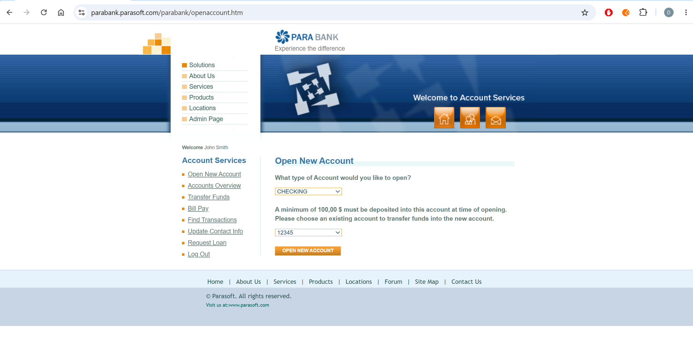

The test verifies that the account creation is successful:

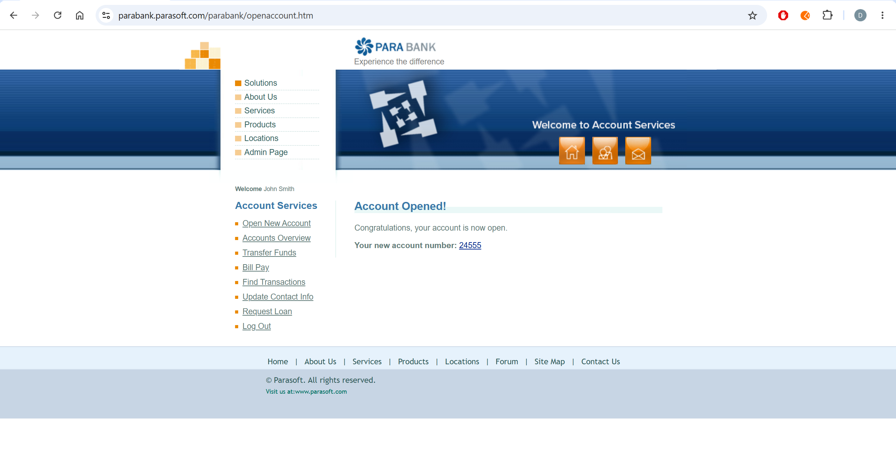

It also checks that the new account is displayed in Accounts Overview:

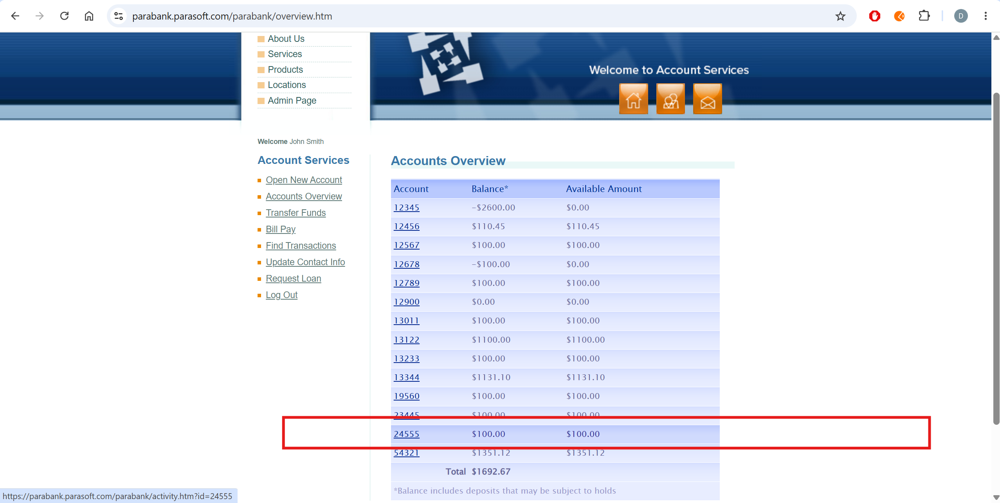

---

## Bill Pay

The API prepares a funded source account.

Selenium authenticates the customer, opens the Bill Pay page and submits a payment.

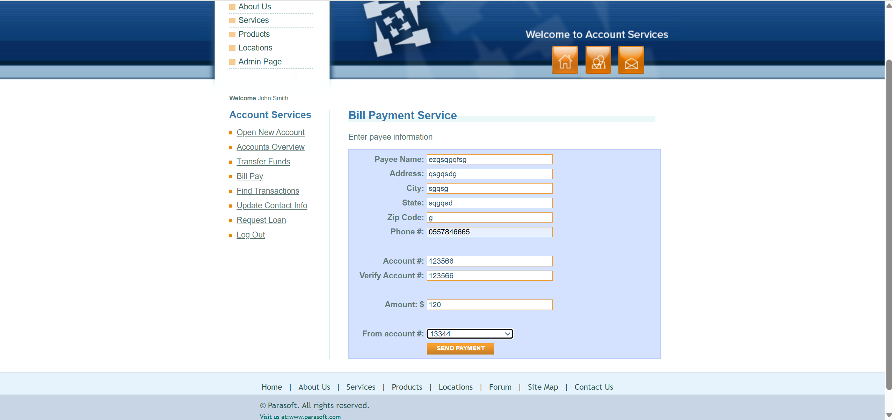

The framework also checks:

- successful payment;
- missing mandatory fields;
- invalid amount.

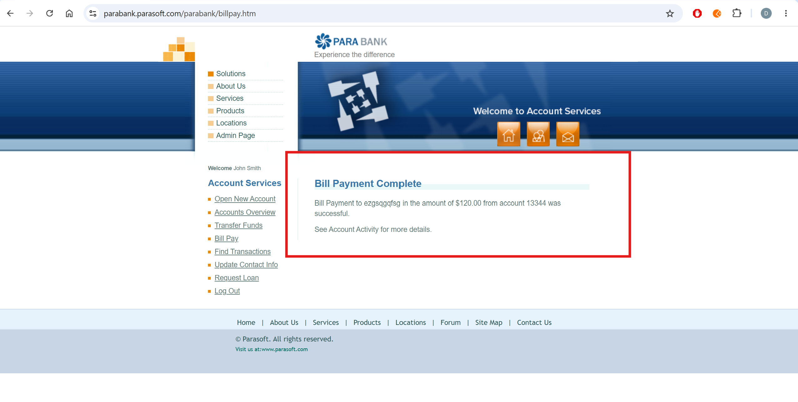

---

# Notes

ParaBank is a public demonstration environment.

The test data can change between executions, and the service may sometimes respond slowly or return temporary server-side errors.

The project demonstrates:

- API testing;
- UI testing;
- hybrid API/UI scenarios;
- shared scenario data;
- Page Object Model;
- conditional recovery from a known public-environment issue;
- Cucumber reporting;
- continuous integration.

---

# Possible improvements

Possible future improvements include:

- Attach a screenshot to the Cucumber report when a UI scenario fails
- Add cross-browser execution
- Add more negative scenarios and assertions
- Handle UI failures with page-specific error states instead of relying on a generic CSS error locator
- Move credentials and demo customer data to environment variables
- Run API and UI tests in separate CI jobs
- Add a scheduled GitHub Actions execution
